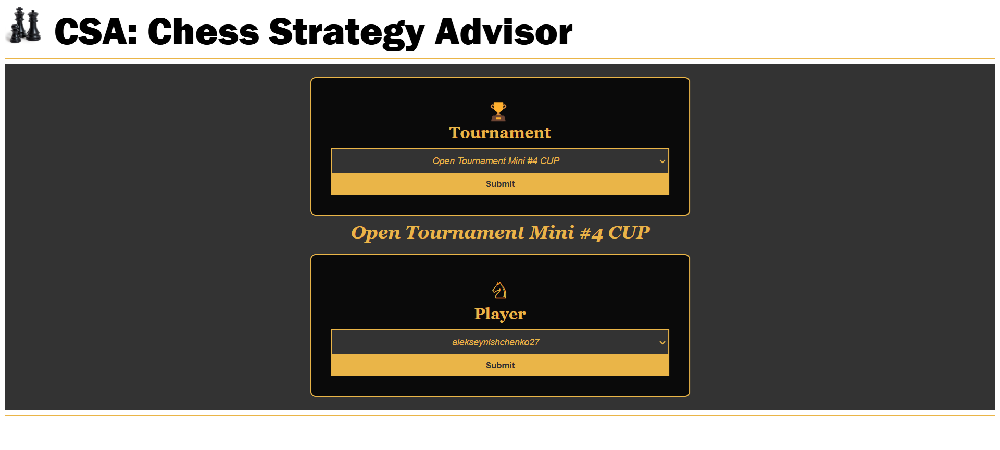
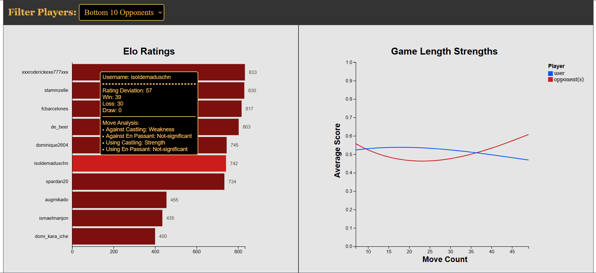
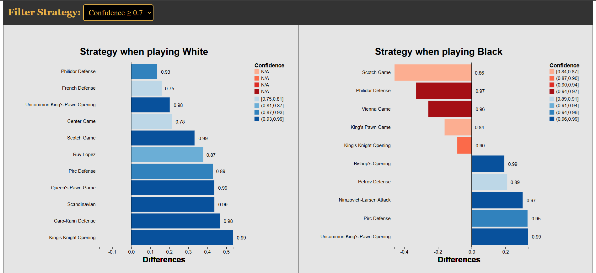

# Chess Strategy Advisor
A web based tool to help a player prepare for an upcoming tournament on Chess.com. It analyzes opponents in the tournament as a group, looking for common patterns of weaknesses to exploit and strengths to avoid. Specifically, it looks into opening moves, how opponents perform in long versus short games, and how well they play special moves (Castling and En Passant).

# Paper
The study's paper can be found on https://drive.google.com/file/d/1I_ndoT6L7sVo8AN_Un9e9n9_WopFye4k/view?usp=sharing.

# Poster Presentation
Poster: https://drive.google.com/file/d/1I_ndoT6L7sVo8AN_Un9e9n9_WopFye4k/view?usp=sharing  
Video: https://youtu.be/BifRWbYc8EU

# Landing Page
Player selects tournament and username
  

# Strategy Page
Figure below shows Elo ratings of a group of opponents (left plot), how they play special moves (left plot, on hover), and performance in long versus short term games (right plot).
  

  
Figure below shows opening strategies when playing white (left plot) or black (right plot). Strategies in red hues are not recommended while in blue hues are recommended.
  

